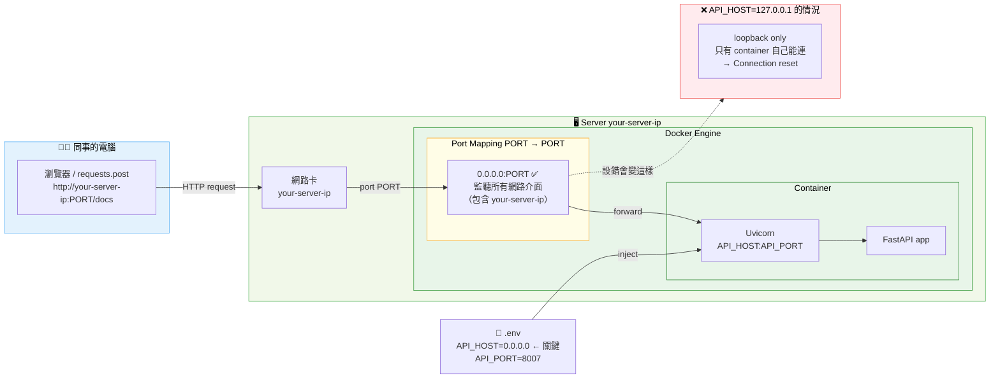

# Docker 部署說明

## 快速開始

```bash
cp .env.example .env
# 編輯 .env，設定 API_HOST 和 API_PORT
docker compose build
docker compose up -d
```

確認服務：

```bash
docker compose logs api
# 應看到：Uvicorn running on http://0.0.0.0:PORT

curl http://localhost:${API_PORT}/
# → {"status": "running"}
```

Swagger UI：`http://your-server-ip:${API_PORT}/docs`

---

## Port Mapping 說明



### 重點：`API_HOST` 一定要設 `0.0.0.0`

| API_HOST | 效果 |
|---|---|
| `0.0.0.0` | 監聽所有網路介面，外部可連 ✅ |
| `127.0.0.1` | 只有 container 內部可連，外部 connection reset ❌ |

---

## .env 設定

```bash
# cp .env.example .env 後修改

API_HOST=0.0.0.0      # Docker 部署必須是 0.0.0.0
API_PORT=8007         # 每個人用不同 port，避免衝突
```

> 本地開發（不用 Docker）可以設 `API_HOST=127.0.0.1`，只有自己看得到。

---

## 常用指令

```bash
# 啟動
docker compose up -d

# 查看 log
docker compose logs -f api

# 停止
docker compose down

# 重新 build（改了 code 或 requirements.txt 後）
docker compose build
docker compose up -d
```

---

## 已知問題

| 問題 | 原因 | 解法 |
|---|---|---|
| `Connection reset` | `API_HOST=127.0.0.1` | 改成 `0.0.0.0` |
| port 衝突 | 同事用了同一個 port | 改 `.env` 的 `API_PORT` |
| 改了 code 沒生效 | Docker image 沒重 build | `docker compose build && docker compose up -d` |